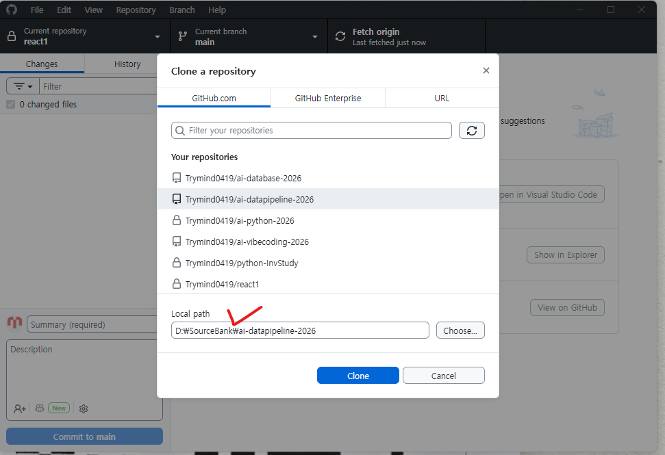
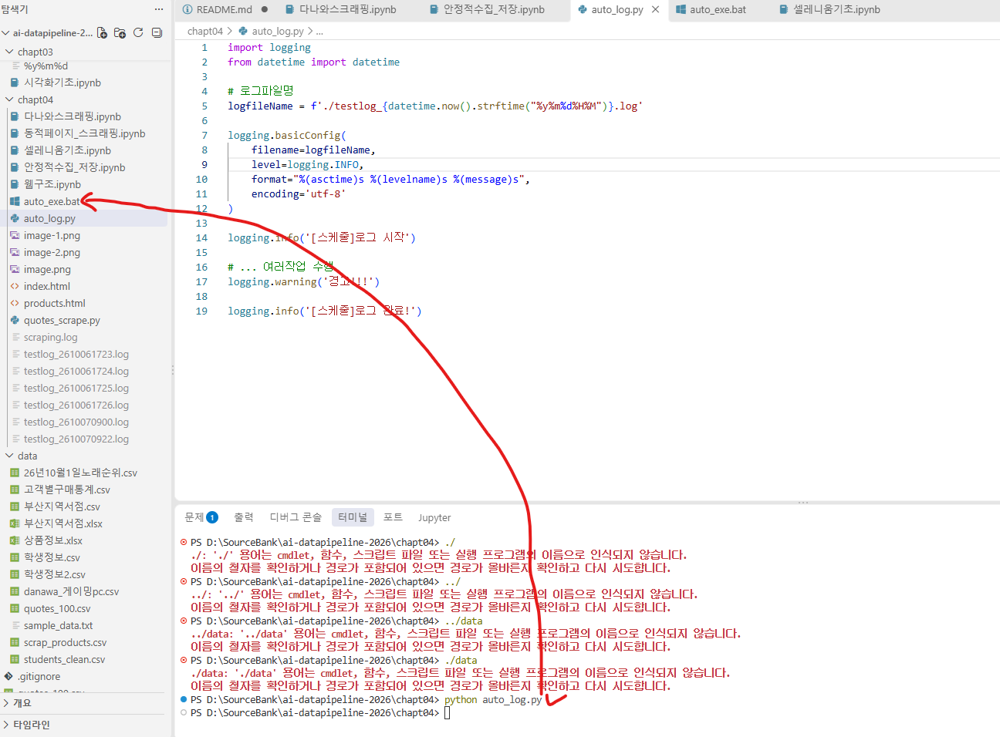
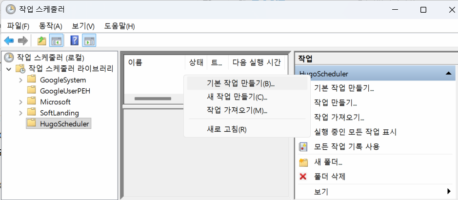
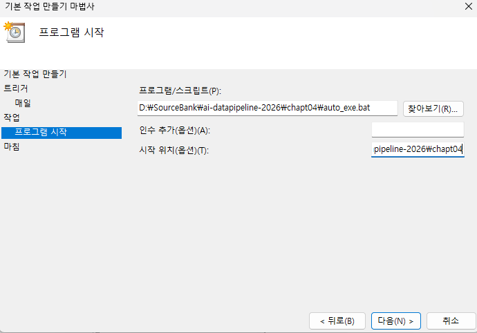
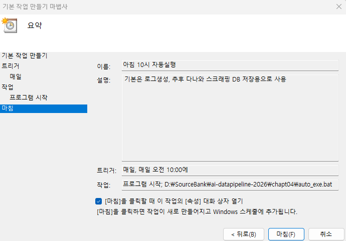
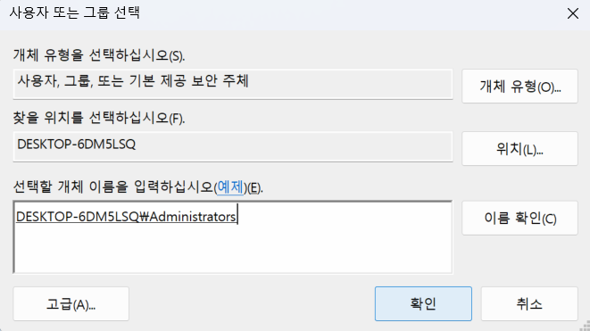

# AI에이전틱 개발자 데이터파이프라인 과목 2026

### GITHUB Clone 시 주의점

- 파일 경로 체크!

## 개요

**데이터 파이프라인** - `도메인`에 필요한 데이터를 수집, 정제·변환, 저장·분석 시스템으로 전달하는 일련의 자동화된 처리과정

- 과거: 전문가가 수동으로 하나씩 작업
- 현재: 자동화 시스템 구축 -> 손쉽게 작업

원천 데이터가 목적지에 도달, 활용 전까지 수집, 처리, 전달을 자동화하는 시스템

예시. 쇼핑몰 매출 데이터 분석

1. 주문 데이터 발생
2. 주문 데이터 csv나 excel, DB에서 가져옴
3. 잘못된 값, 누락된 값, 중복 데이터 등을 정리
4. 상품별 매출, 일별 매출 계산
5. 정리된 데이터로 파일, DB에 저장
6. 저장된 데이터를 분석, 시각화
7. 머신/딥러닝 통하여 미래 예측

| 단계 | 의미                              | 예시                                             |
| ---- | --------------------------------- | ------------------------------------------------ |
| 수집 | 데이터 가져오기 단계              | CSV/Excel 읽기, DB select, API 호출, 웹 스크래핑 |
| 정제 | 잘못된 데이터 고치는 단계         | `결측값` 처리, 중복 제거                       |
| 변환 | 분석하기 좋게 바꾸는 단계         | 날짜 변환, 계산 컬럼 추가 등                     |
| 저장 | 처리결과 보관 단계                | CSV, Excel, DB 저장 등                           |
| 활용 | 데이터 분석하거나 서비스 사용단계 | EDA, 대시보드, 보고서                            |

### 학습 기술스택

1. `Numpy` - 배열을 더 손쉽게 사용하도록 만든 패키지
2. `Pandas` - 표 형태로 데이터를 가공할 때 필요한 패키지
3. `Matplotlib` - 시각화(차트)용 패키지
4. `Seaborn` - Matplotlib을 미려하게 변경해주는 패키지
5. `Selenium` - 자동으로 데이터를 수집하는 패키지
6. Folium - 지도를 시각화 패키지
7. BeautifulSoup - 정적으로 데이터를 수집하는 패키지

### 기술스택 기초학습

#### NumPy

- 파이썬에서 숫자 데이터를 빠르게 처리하기 위한 대표적 라이브러리(패키지). Pandas, Selenium 등으로 연결
- [보기](./chapt01/NumpyBasic.ipynb)

#### Pandas

- 표 형태의 데이터를 손쉽게 다루기 위한 파이썬 라이브러리(패키지)
- NumPy가 숫자 배열을 처리, Pandas는 행과 열로 실제 데이터셋 읽고, DB처럼 선택, 요약, 수정하는 도구
- [판다스기초](./chapt01/pandas.ipynb)
- [데이터정제](./chapt02/pandas.ipynb)
- [데이터처리](./chapt02/판다스데이터처리.ipynb)
- [데이터](./chapt02/판다스집계.ipynb)

#### Visulization - Matplotlib, Seaborn

- Pandas, NumPy로 정제할/정제된 데이터를 시각화하는 라이브러리(패키지)
- EDA(Exploratory Data Analysis) : 탐색적 데이터 분석 시 사용
  - 항목별 크기 비교 : 막대 그래프
  - 시간에 따른 변화 : 선 그래프
  - 숫자 데이터 분포 : 히스토그램
  - 두 숫자 데이터 관계 : 산점도
  - 이상치 확인 : 박스플롯
- [시각화기초](./chapt03/시각화기초.ipynb)

#### Selenium

- 웹 페이지에서 필요한 데이터를 수집해오는 자동화 라이브러리(패키지)
- 데이터 수집 방법: OpenAPI 사용, 스크래핑
- 기본적 `HTML`, `CSS`, JS...

  - [웹구조](./chapt04/웹구조.ipynb)
  - CSS의 경우도 속성명에만 신경쓰면 됨. `class="class_name"`, `id="id_name"`
  - 웹페이지를 html로만 구현하지 않고 js로 동적으로 만드는 경우도 있음. 웹 스크래핑 어려워짐
  - 필요한 경우는 `페이지 소스 보기`로 한줄씩 확인하면서 처리해야 할 경우도 있음
- [셀레니움 기초](./chapt04/셀레니움기초.ipynb)
- [동적페이지 스크래핑](./chapt04/동적페이지_스크래핑.ipynb)
- [실제 사이트 스크래핑 다나와](./chapt04/다나와스크래핑.ipynb)
- [안정적 수집 및 저장 ](./chapt04/안정적수집_저장.ipynb)

#### 프로그램 자동 실행 스케줄링

- Windows 작업 스케줄러
  1. 파이썬 실행 : `python 파이썬 파일명.py`
  2. 배치파일로 생성 : `배치파일명.bat` 안에 위의 파이썬 실행 명령을 입력
  3. 
  4. 윈도우 키 > `작업 스케줄러` 검색 후 실행
  5. 관리목적의 폴더 생성
  6. 
  7. 우클릭 > `기본 작업 만들기` 선택
  8. 위저드 화면 > 기본  작업 만들기 > `이름`과 `설명` 기재
  9. 위저드(마법사) 화면 > 트리거 > 작업 시작일자를 작업 프로세스에 맞춰서 매일, 매주, 매월, 한 번 등 선택
     1. 시작할 일자와 만료할 일자, 기간 등 선택 별로 상이한 설정 옵션 지정
  10. 위저드 > 작업 > `프로그램 시작` 선택
      1. 프로그램 시작 > 프로그램/스크립트 선택, 프로그램의 경우는 인수 추가, 스크립트 경우 시작 위치 작성
      2. 
      3. 프로그램의 경우 인수를 프로그램 파일이 변경될 때마다 작업 스케줄러에서 변경해야 함
      4. 스크립트(bat)의 경우 배치파일만 수정하면 되므로 편리
      5. 파이썬 실행 명령이 작업 스케줄러에서 제대로 동작 안하는 경우 발생
  11. 위저드(마법사) > 마침 > `[마침]클릭할 떄 이 작업의 [속성]` 대화상자 열기 체크 후 마침
  12. 
  13. 속성 창의 보안옵션 사용자 User에서 관리자 그룹 `Adnubustrators` 로 변경 필요
      1. 사용자 또는 그룹 변경 버튼 클릭
      2. Administrators를 검색 후 확인
      3. 
      4. 확인 후 보안 옵션, 가장 높은 수준의 권한으로 실행 체크
      5. 
  14. 작업 스케줄러에서 동작여부 확인. 실행 버튼 눌러서 수동으로 생성 확인.
